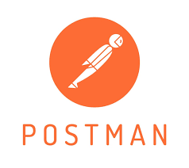

# Portifolio

Test de API com Postman **(Manual/Automatico)**

## Projeto Teste de API

Realizei testes manuais e automatizados de **API REST**  utilizando o POSTMAN, validando requisições POST E GET. Dessenvolvi scripits para verificar **status code, campos de resposta, valores especificos e tempo de resposta** . 

A API utilizada é ( JSONPlaceholder) , é uma API de teste Fake, que retorna um ID ao criar um POST, mas não armazena dados realmente. Sendo assim o GET não retornou o conteúdo criado. Porém esse comportamento não afeta a validação dos testes automatizados. 

## Ferramentas Utilizadas

- Postman 
- JavaScript
- <a href="https://jsonplaceholder.typicode.com/">PIJASONPlaceholder</a>

